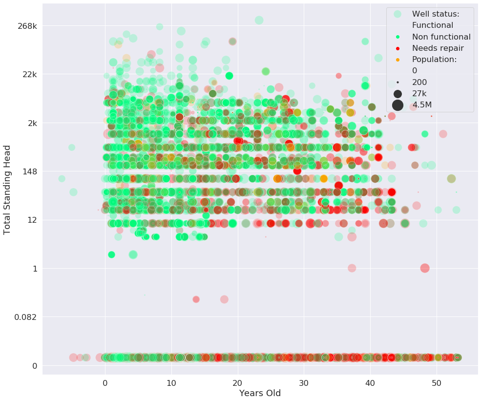

# Predicting the functionality of waterpoints in Tanzania
Multiclassification machine learning project. Most of the work is done in the "Project_Notebook.ipynb" file. However there are several external python files used to store most of the functions:

- cleaning_functions.py
- feature_engineering.py
- model_classes.py
- visualization_functions.py

The data and contest information can be found [here](https://www.drivendata.org/competitions/7/pump-it-up-data-mining-the-water-table/page/23/)

